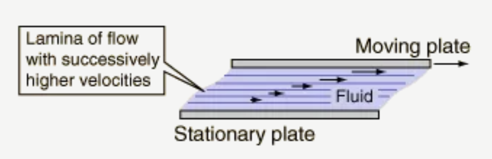
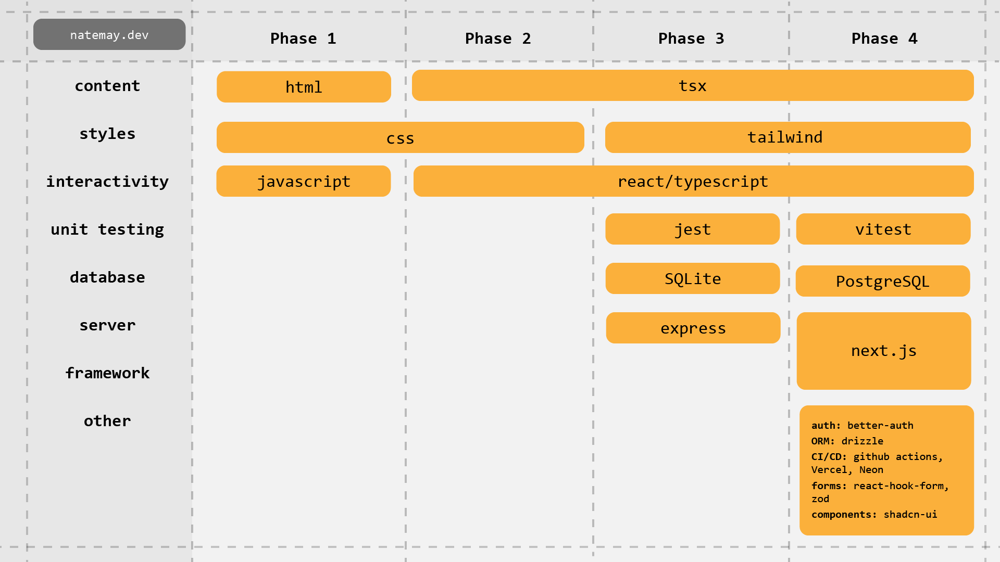

Two hundred thirty-four days ago I decided to stop writing spaghetti code and focus on quality. I had been building apps for my online music school and coding for my compositions, but I had decided to transition to full-time software development. I knew this meant that, beyond just getting the code to work, other people should also be able to read it without gagging.

Today I’m officially entering the market as a software engineer. I’ve achieved explosive growth in my skills in that time with very little financial investment. I wrote this post to document that process.

---

For awhile I had thought about bootcamps, but the more I looked into the actual skills I would need and the free resources available, the more I became convinced that I could create my own roadmap that would be most effective for me personally.

I met with [Jerome Hardaway](https://frontendmasters.com/teachers/jerome-hardaway/), who has mentored many people into the profession, and he told me to focus my process on the “learn-build-share” cycle. This fit well with what I had in mind. I’m a very real-world-project learner, so the “build” and “share” parts was welcome news. At the same time, since I had already spent years coding in a “it works on my machine” kind of way, I wanted to take this opportunity to “learn” the slow way—by starting from fundamentals and building up to abstractions.

---

I’ve come to understand the modern web ecosystem to be like the [laminar flow](https://en.wikipedia.org/wiki/Laminar_flow) of a smooth river:

Close to the riverbed, the water moves relatively slowly. Here we have the languages actually understood by browsers themselves--HTML, Javascript, and CSS--as well as SQL and server Javascript runtimes (writing code for Deno isn’t that different than for Node, even if it’s doing very different things with that code).

Midway up to the surface are the faster-moving abstractions—frameworks like React and Next, and libraries for forms, validation, data queries, ORM, state management, etc. These are designed to allow you to encapsulate best practices so you can forget about what goes on under the hood. There’s always a hot one of each at the moment, and it’s always changing.

At the surface is AI prompting—the greatest abstraction of all—which changes the relationship between input and output not only every release cycle, but every time you re-generate.

I knew that the top two layers each depend on the layer below them. Working at the highest layer of abstraction, if done with taste, means working efficiently and effectively. But getting too comfortable at the top risks getting lost when the abstractions change out from under you.

So to arrive at the top, I started at the bottom.

---

I decided to split my roadmap into four phases:

1. **Phase One**: HTML, Javascript, and CSS.
2. **Phase Two**: Add React and Typescript.
3. **Phase Three**: Add a backend in Node/Express, a database in SQLite and styling in Tailwind. Here I also learned how to craft REST APIs, TLS security, protocols (HTTP, TCP, UDP), unit testing, and regex.
4. **Phase Four**: Embrace all the modern tools of web development _except_ AI completion/prompt generation. Here I picked up Next.js, PostgreSQL, Drizzle ORM, Better-Auth, Zod, React-Hook-Form, ShadCN UI. I put together a CI/CD pipeline using Github Actions that included end-to-end testing in Playwright. I also did a deep dive into web accessibility.

With this roadmap in place, I completed the “learn-build-share” cycle for each stage:

---

_Learn._ The structured learning was all through free resources that were as authoritative as possible: official docs ([React’s guide](https://react.dev/learn) in particular is 🤌), and for the more fundamental concepts through [Eloquent Javascript](https://eloquentjavascript.net/) and the [Launch School bookshelf](https://launchschool.com/books). I kept an Obsidian vault full of detailed notes on everything, which helped me both process and review information, and I completed almost every exercise introduced in these materials.

I’ve also been interested lately in the idea that machine learning presents an underrated model for human learning, because it was modeled on how humans _actually_ learn—not how we teach. The biggest takeaway from this is that examples and immersion are a highly effective way to absorb information, even if not all of that information is in the [zone of proximal development](https://en.wikipedia.org/wiki/Zone_of_proximal_development). When learning Next.js I was constantly referencing the code in active production codebases I found through [this article](https://dev.to/datarockets/real-world-open-source-projects-built-with-nextjs-14-and-app-router-i1n?utm_source=chatgpt.com). While driving, cooking, and cleaning I would listen to podcasts like [Software Engineering Daily](https://softwareengineeringdaily.com/), [Software Engineering Radio](https://se-radio.net/), and [Signals and Threads](https://signalsandthreads.com/) to hear professionals on the cutting edge talk about the problems they’re solving. And if I was too mentally exhausted to do anything else I would just watch someone on YouTube build an app from scratch.

_Build._ The capstone of each of my phases was a real app with real users:

1. **Phase One**: Chordle, a chord building game I built in 2021 ([Learn more](/projects/chordle)). ChatGPT didn’t exist at the time so there was a lot of Stack Overflow involved.
2. **Phase Two**: Hose Race, a word racing game on the Bluesky firehose that I wrote about here. ([Learn more](/projects/hose-race)) I used ChatGPT for advice and occasionally a few lines of code.
3. **Phase Three**: Finfetch, which allows you to download all your bank transactions to CSV. ([Learn more](/projects/finfetch)). Similar approach to AI use as Hose Race.
4. **Phase Four**: Synthase Studio, which I open sourced at the completion of the first phase of the project ([explanation here](/blog/announcing-synthase-studio)). Still deliberately no AI completion or direct prompting, but I expanded to v0 and AI code review from Github.

_Share._ They’re all original ideas (not clones or generic todo apps), and they either solved a real problem or were designed to entertain, so I was able to find real users and get good feedback.

1. Chordle went viral on Twitter in 2021. It was played by up to 7,000 people per day, and was adopted in music theory classrooms across the country.
2. Hose Race received 164 upvotes on Reddit, and on Bluesky it was reposted by engineers on the core Bluesky team as well as Martin Kleppmann who wrote the book _Designing Data-Intensive Applications_, which was the blueprint for the Bluesky architecture.
3. Finfetch has received 13 stars on Github since I released it two weeks ago, but more importantly I got my wife to admit that it’s useful 🙌.
4. Synthase Studio is in development and it’s been met with excitement from music educators.

I also created this blog to share thoughts on all of this. That gave me an excuse to learn Astro, which was nice.

---

Getting through this roadmap (minus Chordle which was already complete when I started) took me nearly eight months of working 2-8 hours a day. I spent a grand total of somewhere in the range of $100-$150, which went entirely toward two sessions with mentors I found through [Codementor](https://www.codementor.io/). I can genuinely say I had a blast in the process—I was very hungry for this stuff and I still am.

Now that these steps are complete I feel ready not just to build, but to build scalably and maintainably with AI tools that will help me optimize while avoiding the [evils of premature optimization](https://stackify.com/premature-optimization-evil/). I can navigate the blurriness that React and Next create between client and server, because I’ve built separately for each and understand how they each behave. I choose the SQL-like syntax in Drizzle because I’m comfortable with SQL, so if Drizzle goes the way of the [drummers in Spinal Tap](https://www.youtube.com/watch?v=TW6W9iOjTKM), I can switch to its replacement. When Tailwind utility classes start to get a little slap-happy, I just head on down to `global.css`. I feel comfortable picking up a framework like Vue or Angular, because I’ve written the same raw-JS DOM queries that they use internally.

---

This is kind of a turbulent time to enter the market as a software engineer, but I’m feeling naively optimistic at the moment. AI development tools give companies the capability to do the same amount of work with fewer engineers, or to do more work with the same number of engineers. I imagine the market forces will push companies to ship faster, which suggests the latter. At least until machine superintelligence arrives, which I’m hoping never happens.

I’m also now equipped to continue to build on my own. I have a whole lot in the pipeline, and I’m not stopping here.
