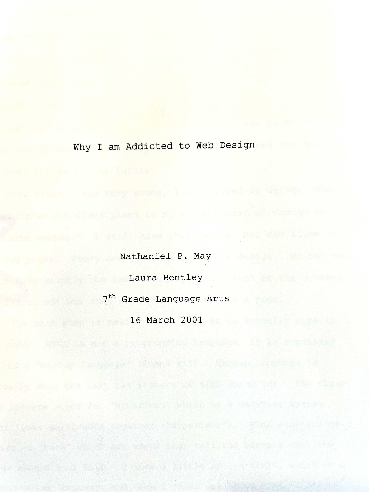
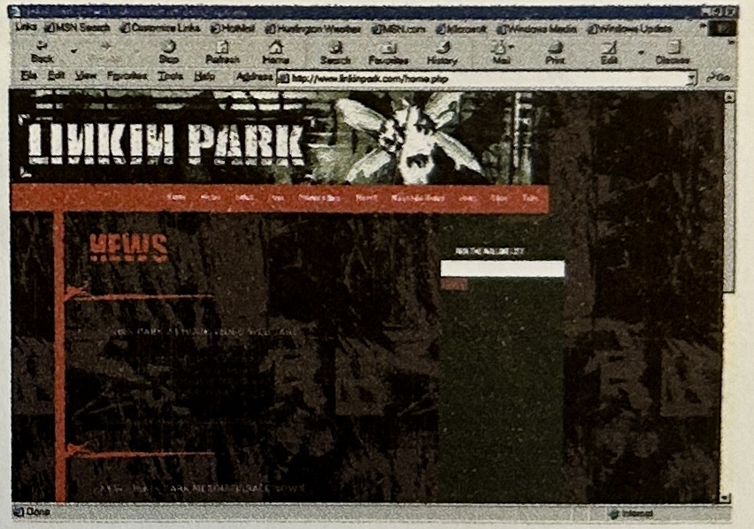

A couple months ago I was clearing out old boxes in my parents’ basement when I came across this:

I talked to a couple of web developers for this 7th-grade project, including Naveen Jain, a 19-year-old kid who had just built a website for band I hadn’t heard of yet, but that I would soon become obsessed with:

Finding this brought back a flood of all-caps HTML memories. I was truly obsessed: I built my Dad’s website, I built a little general reference hub, and I went to the local bike shop and talked them into letting me build their site (they’re still in business but they’ve had the sense to [move on](https://jeffsbikeshop.com/)).

It was all a fascinating world to a kid who loved problem solving and had an insatiable creative side. In high school my coding interest manifested in making hangman and some kind of desert island RPG for my TI-83 graphing calculator.

But then I stopped.

I had chosen music as a career path, and that’s not a choice that leaves room for just about anything else.

---

This post is my first in a new site that represents a bit of an identity shift for me: I’ve spent my adult life as a musician and music educator, all the while harboring a desire to create things that are not just beautiful, but useful. I’m now taking that path: I’m learning how to use code to build things on the web. This post fills in more of those gaps.

---

In 2015 I was working and studying as a composer. I found that I wanted to hear musical processes that operated with an internal logic more pure than I could conceive using intuition alone, so I started writing algorithmic music—by hand.

[image of algorithms]

In retrospect my renewed interest in code came slowly and in layers, building up from the smallest primitives to the deepest abstractions. Until a few months ago, there was nothing intentional about this path, but I can see now how much value there is in this way: starting with raw materials, molding them clumsily while finding a purpose for them and getting a feel for their properties, then optimizing and deepening.

That summer the composer Elliot Cole showed me how to use the Music21 Python library to turn my logic into code. I didn’t know anything about Python, but the Music21 docs were unusually beginner-friendly, so I was soon banging out some algorithms in TextEdit and saving them in my Mac’s `site-packages` folder because I had no idea how the terminal worked.

I used one of these processes for this piece, which is like a pixelated zooming-in on the ratios of the overtone series.

[soundcloud embed]

In 2018 while a doctoral student at Yale I convinced a professor, Scott Petersen, to let me take a grad-level computer science course that focused on algorithmic music, taught in a relatively obscure language called Supercollider. This remains the only formal coding class I’ve taken.

The following year I got the idea to slice up a Beethoven symphony into thousands of pieces and sort them into categories based on their sonic properties using machine learning. I managed to do this using TensorFlow, but I was in so far over my head that I actually broke my laptop’s fan by running some kind of cumulative process that took a dozen or so hours overnight.

By 2020 I was starting to see the untapped possibilities of the interactive web for music education. I learned some Javascript from Daniel Schiffman’s Coding Train series on YouTube, and I built prototypes of music education apps.

At this point I was getting very passionate about building with code, and about the things I could build. I lived in a tiny sunless Brooklyn apartment while teaching music in Manhattan and New Jersey, and instead of doing the things I moved to New York to do, I would go into coding vortexes, spending hours and days writing code. When Tawny, my then-girlfriend-now-wife, came to visit me, she found me pale and somewhat emaciated.

Then Covid hit New York. I was away visiting my parents at the time, so I stayed away, bivouacking for four months in West Virginia, Vermont, and then California. I was teaching online, and when I wasn’t teaching I retreated even further into code, solving the problems I was finding in my teaching, and exploring more compositional possibilities.

By 2021 I had moved to Silicon Valley to live with Tawny, who had made her way from academia into a non-engineering tech role. I too was getting disillusioned with academia for a number of reasons. I founded Synthase, an online school for music creators, to teach creative music in a new way, empowered by technology.

During early 2022 I joined the giddy Wordle spinoff-osphere, releasing a chord-based version called Chordle that I made in HTML, CSS, and Javascript, using almost no libraries (just Tone.js for sound). It was a hit, jumping quickly to 7,000 users in a single day. I was soon seeing photos from across the US of teachers using it in their music classrooms. Sometimes when I would meet people for the first time I would find out that they had already played Chordle. I had made something useful, and that felt good.

---

In 2024 Tawny and I became parents. It changed so much about my priorities. It stopped making sense to keep betting on Synthase to become a sustainable full-time operation both for myself and Susie Ling, who had come on as a co-owner. I decided to turn fully toward this indulgence I had had for over two decades, but to do it properly.

I decided to become a software engineer.

By then, AI was already changing the field rapidly, so there was a lot of uncertainty wrapped up in the decision, and there still is. But I’ve gained some superpowers that I think will help with this evolution. To start with, I feel like I’ve fully blossomed as a generalist in a way that allows me to see the big picture. I’ve learned balance. I’ve learned how to work in teams and contribute on a human level. I’ve learned to communicate.

What was left was to learn to code in a performant, readable, maintainable way. I needed to learn not just how to get from point A to point B, but how to architect, debug, test, deploy, and observe. I made a roadmap for myself, which will be the topic of a future blog post.

I’m now two-thirds of the way through this roadmap, and I already feel many times more powerful and confident than my previous spaghetti-code writing self. I believe that until an Artificial General Intelligence arrives that obsolesces all of us who work with our minds, this ability to build will be of value to people.

Stay tuned to learn more about the things I’m building.
