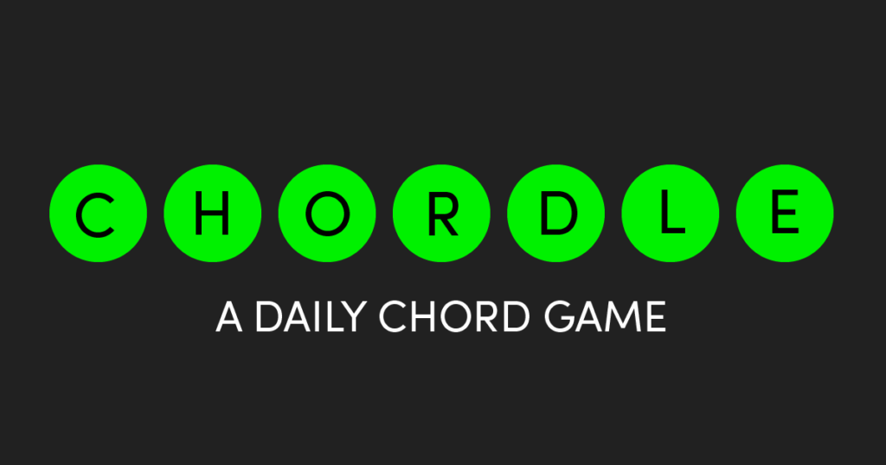
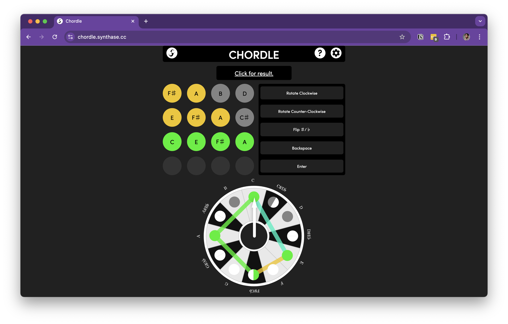

In January of 2022 I was emerging from a bout of Covid when I hopped on the wave of Wordle spinoffs and created Chordle, a daily chord game. As a music theory teacher I knew the importance of drilling how to build chords, which comes as second nature to most professionals but is a struggle for most beginners. Although I prefer doing these things in musical context when possible, I saw an opportunity in Wordle to give this practice a fun twist. At the time I had messed around with some JavaScript and HTML, so this was my first project to actually produce something for the world.

I started from scratch without a framework, inspecting the layout of Wordle to learn how to build up mine, and making adjustments to fit the use case. I included sound via a custom-built synth in the Tone.js library.

I recruited 40 testers among friends and sent them progressive drafts, asking for feedback and tweaking as I went.

I was glad I had done all of this testing before release, because within 15 hours of announcing it with a post on Facebook Chordle had been played on every continent except Antarctica. It soon spiked up to 7,000 users in a single day. I began to see my Twitter feed flooded with the little circles of people sharing their scores, and even photos of teachers using it in K-12 and post-secondary classrooms. I started to get emails with feedback, and I made some updates to address the pain points the users were having.

It was a pretty exciting introduction to web development, and I was glad that I made it all using only HTML, JavaScript, and CSS (even if I look back on that code now and hope nobody reads it…). Avoiding a framework resulted in code that’s low-maintenance and performant, and more importantly it taught me the only languages that browsers understand.

If you are new to music it might be a little confusing to you, but if you know something about building seventh chords I encourage you to [give it a spin](https://chordle.synthase.cc).
