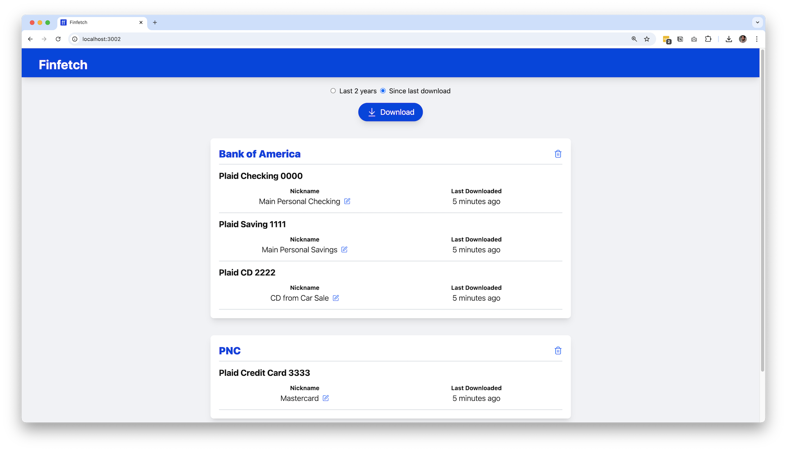

I run a small [online business](https://synthase.cc/). Given that it's both small and online, our financial books are pretty simple. There's no inventory. No loans. Nothing depreciates. Nothing vests. [Money comes. Money goes.](https://www.youtube.com/watch?v=cKEwnhc8ItY)

For a couple of years I paid for Quickbooks. Quickbooks is double-entry bookkeeping software that both a) requires you to know double-entry bookkeeping, and b) very awkwardly tries to abstract away any double-entry bookkeeping. At some point it occurred to me that at the heart of my paid Quickbooks account was a very simple database and some pretty simple queries.

I began to wonder if there was another way.

It turns out that there's a special place for everyone who has this realization and follows its logic: the world of Plain-Text Accounting. It dates back at least as far as 2003 with the open-source CLI tool [Ledger](https://ledger-cli.org/), which is still actively maintained.

The premise of Plain Text Accounting is this: _it's perfectly possible and sufficiently robust to keep your books in a text document that both humans and machines can read._

That document looks something like this:

```text
2025-02-27  stripe payout
    assets:bank:checking       $98.17
    revenue:services

2025-02-28  notion
    expenses:software         $200.00
    liabilities:credit card

```

I dug into the slightly more modern Haskell port of Ledger called [hledger](https://hledger.org/). It had everything I needed. But there was one thing I wanted. Something that Quickbooks gave me: an easy way to sync my bank and credit card transactions.

Hledger already has a convenient CSV import function, but no native way to get the actual transactions. I knew that logging into all of my accounts and downloading/importing separate CSVs would create enough friction that I would have trouble keeping the books up to date.

The Plain Text Accounting community has been [mulling on this for awhile](https://www.reddit.com/r/plaintextaccounting/comments/fytyhp/how_do_you_automate_downloading_bank_details/) and has found or created some solutions, like [plaid2qif](https://github.com/ebridges/plaid2qif) which can also produce CSVs. But I found a few problems with the existing tools:

- many rely on the OFX protocol, which seems to be on the wane
- they require you to manage your own access tokens
- they tend to be GNUCash focused rather than general-purpose

So I decided to build a new solution. I wanted it to be as close as possible to just a single Download button that would aggregate all of my relevant transactions across all of my bank accounts and save them as a CSV. I came up with these requirements:

- runs locally
- SQLite database for storing account information
- encryption on the access tokens in that database
- UI for seeing which accounts you have linked and adding/removing
- big button to download

This would not only be helpful to the Plain-Text Accounting community, but anyone else who wanted to keep records of their income and expenses simply and locally, like in spreadsheets.

---

Since I was also using this project to learn traditional client-server architecture, I settled on the following tech stack:

- Frontend in React with Tailwind CSS
- Deno runtime on the server (easier than Node to install, since some users may not already have Node installed; also runs faster)
- REST API in Express (not strictly necessary with Deno, but I wanted to learn it)
- SQLite database
- Plaid bank API (integrates with so many banks and as a bonus, uses consistent spending categories across all of them)

Each user needs their own Plaid API key, which they save in a `.env` file. The user then spins up a Deno server with a simple command, which opens a web page running on localhost (served via Express from the `dist` folder built by Vite). From here with a few clicks, the user can set a password, add their banks and credit cards, and then click the “download” button to download a CSV file. The user can choose between downloading all transactions from the past two years, or just the new ones since they last time they downloaded. This will include all added, modified, and removed transactions as separate CSVs wrapped in a Zip file. The user can also give each account a nickname.

This provides an ideal workflow for someone with a plain-text accounting system like hledger. The nickname field can be used to provide the account name in the user’s journal, and the new transactions can be imported with a set of rules set through hledger’s [CSV import flow](https://hledger.org/1.42/hledger.html#csv). Spreadsheet users can copy-paste the new transactions into the end of a spreadsheet, and then keep a separate sheet that pulls over only the columns they need.

I’m now using Finfetch for both personal and business bookkeeping, and it’s solving a real problem for me.

---

I probably would have finished in half the time if I hadn’t felt the need to think about security. While the Plaid API for Finfetch is configured only to be able to read transaction data and not initiate any payments or transfers, anyone with access to the tokens Plaid provides would be able to download the user’s bank transactions.

The first thing I checked was whether or not I could access the server process from another device on my local network. I tried using `curl` to hit one of the API endpoints from a different computer, and sure enough, nothing stopped me. This ended up being an easy fix: when Express is [set to listen](https://github.com/natepmay/finfetch/blob/main/backend/main.ts) specifically to port `127.0.0.1` rather than `localhost`, it denies requests from all other IPs. So your neighbors can’t snoop on your credit card charges just because they’re mooching your wifi.

I also wanted to make sure that the access tokens were encrypted at rest. This requirement altered the architecture of the entire app, since it meant adding an authorization step, keeping the authorization key in state, and encrypting/decrypting on the way [in and out of the database](https://github.com/natepmay/finfetch/blob/main/backend/db.ts). In retrospect I probably should have used a library like [bcrypt](https://www.npmjs.com/package/bcrypt) to help with this, but I ended up relying directly on the [Web Crypto API](https://developer.mozilla.org/en-US/docs/Web/API/Web_Crypto_API). Instead of actually storing the user’s password, only the password salt is stored with the user. When the user attempts to authorize, the password they enter is used in combination with the stored salt to [generate](https://github.com/natepmay/finfetch/blob/main/frontend/src/api.ts) a `cryptoKey` . The app then attempts to decrypt one of the access keys with this `cryptoKey` and sends back a success or failure message. In this way, passwords stay on the client and access tokens stay on the server.

But since the client and server run on the same machine, I didn’t worry much about securing communication between the two. I included a note in the README to make sure the client and server stay on the same device for this reason. If I were to ever separate them there’d be a lot more work to do.

---

While I want to keep Finfetch simple, there are a few more things I’ve been daydreaming about integrating:

- allow filtering the dates of transactions
- customize which columns are included (there are currently way more than you’d need)
- add some convenient way to add your own categories to each transaction (perhaps this is a different product)
- add a CLI component so that the transactions could be downloaded with a command, and therefore integrated into bash scripts
- oh I dunno maybe a MCP server so you can ask your chatbot to talk you through your latest transactions

---

If Finfetch sounds useful for you, feel free to [take it for a spin](https://github.com/natepmay/finfetch), and to reach out if you have any feedback.
