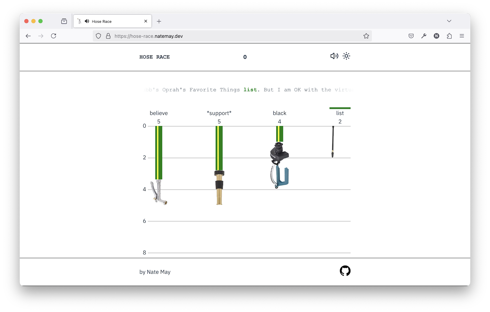
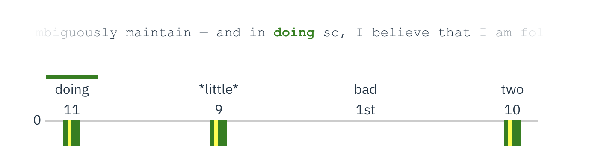

In November 2024 I learned about a new social media platform built on an open protocol, designed with composable services in order to remain billionaire-proof. The platform was called Bluesky and it was receiving a flood of users who were ready to leave Elon Musk’s X.

After joining I quickly became fascinated by the protocol, [atproto](https://github.com/bluesky-social/atproto). I was also learning React at the time and looking for a project to build. I settled on making a game based on the Bluesky firehose—the realtime stream of posts and updates aggregated from all users on the platform.

From a learning standpoint I set some limitations: it had to be client-only, use raw CSS, and I had to write it unassisted by AI code completion (although I allowed myself to use ChatGPT to help me through snags).

The game idea was to race words on the firehose. I wanted it to be like a ridiculous version of the Kentucky Derby in which various hoses, representing words, inched their way down a track. You pick your winner between, say “video”, “he’s”, “talking”, and “used,” and you see how long it takes for each word to appear four times. The fastest is the winner.

---

Besides learning React and websockets, there were some other fun challenges that came up in the process:

To start with, I wanted to group words into “leagues” so that none of the four had an obvious advantage over the others. I also wanted to set the “finish line” (total number of instances they’re racing to) dynamically so that each round would be an enjoyable duration for the user.

This meant I needed to do some data collection.

I wrote a Deno script to [“sip” from the English-language firehose](https://github.com/natepmay/hose-race/blob/a4ee9744ebe4946f9e269289d55c2b06c53b71db/data/sip.ts) for 30 seconds at a time, recording each word used and the number of times it appeared. I then set up a cron job on my computer to run this every few hours for a week, so I would be sure to cover different times of day on both weekdays and weekends.

I then wrote another script to [compile that data](https://github.com/natepmay/hose-race/blob/a4ee9744ebe4946f9e269289d55c2b06c53b71db/data/analyze.ts), only including words that appeared in _all_ of the sips, and storing the median number of occurrences for each word.

Finally [I sorted those and grouped them](https://github.com/natepmay/hose-race/blob/a4ee9744ebe4946f9e269289d55c2b06c53b71db/data/make-leagues.ts) into leagues of four in this format:

```json
{
  "words": [
    "full",
    "home",
    "sorry",
    "i’ve"
  ],
  "medianPerSecond": 0.31666666666666665,
  "rangePerSecond": 0.03333333333333333
 },
```

`medianPerSecond` is a median of all the medians in the league. The `rangePerSecond` value gave me a sanity check to make sure the leagues were well-matched. After manually reviewing the leagues I was left with 80 or so of them, which I then provided to the client as a JSON file.

I randomized the order within the league so you couldn’t just pick the first one to have the statistically-highest chance of winning. (Hose racing is serious business.)

In the client I created a custom hook [`useLoadLeague`](https://github.com/natepmay/hose-race/blob/a4ee9744ebe4946f9e269289d55c2b06c53b71db/src/hooks/useLoadLeague.tsx) which would randomly pick a league and then calculate the finish line based on that league’s `medianPerSecond` and the ideal number of seconds for a game, which I [apparently decided](https://github.com/natepmay/hose-race/blob/a4ee9744ebe4946f9e269289d55c2b06c53b71db/src/hooks/useLoadLeague.tsx#L4) was 24.

---

When building the client the most interesting problem I ran into was presenting the content of the Bluesky post to the user. While this seems straightforward, I specifically wanted the post to appear as a fragment with the word in question in the center.



In order for this to work on different sized screens I had to break it down into the following steps:

1. Use regex to [get the index](https://github.com/natepmay/hose-race/blob/a4ee9744ebe4946f9e269289d55c2b06c53b71db/src/components/PostCard/PostCard.tsx#L8-L12) of the word within the post string.
2. [Slice out up to 100 characters before the word](https://github.com/natepmay/hose-race/blob/a4ee9744ebe4946f9e269289d55c2b06c53b71db/src/components/PostCard/PostCard.tsx#L14-L17) and save it as `beforeWord`. I chose 100 characters because I knew it would for sure overflow on all screen sizes.
3. [Slice out the word itself](https://github.com/natepmay/hose-race/blob/a4ee9744ebe4946f9e269289d55c2b06c53b71db/src/components/PostCard/PostCard.tsx#L19-L21) (its capitalization may vary) and save it as `displayWord` .
4. [Slice off up to 100 characters after the word](https://github.com/natepmay/hose-race/blob/a4ee9744ebe4946f9e269289d55c2b06c53b71db/src/components/PostCard/PostCard.tsx#L23-L28) as `afterWord`.
5. Place them each in separate [`<span>` elements](https://github.com/natepmay/hose-race/blob/a4ee9744ebe4946f9e269289d55c2b06c53b71db/src/components/PostCard/PostCard.tsx#L57-L65) inside a [single-row CSS grid](https://github.com/natepmay/hose-race/blob/a4ee9744ebe4946f9e269289d55c2b06c53b71db/src/components/PostCard/PostCard.css#L1-L14) with `grid-template-columns: 1fr auto 1fr` and the overflow clipped on the outer elements.
6. Provide a [fade effect](https://github.com/natepmay/hose-race/blob/a4ee9744ebe4946f9e269289d55c2b06c53b71db/src/components/PostCard/PostCard.css#L41-L51) by adding a pseudo-element on the left and right with a background set to a linear gradient terminating in full transparency on one end and the dynamically-set background color on the other (the game supports both dark mode and light mode).

This got me 90% of the way there, but the final 10% was the trickiest. My plan was to right-align the `beforeWord`, center the `displayWord` , and left-align `afterWord`. This worked fine for `displayWord` and `afterWord`, but it turns out that if you right-align in CSS, the overflow still appears on the _right._

Thankfully I came across [this stack overflow post](https://stackoverflow.com/questions/218065/overflow-to-left-instead-of-right) which presented the needed hack: create a nested element and `float` it to the right side, using `white-space: nowrap` on the outer element to ensure it doesn’t wrap.

The final hurdle was that the last character in the `beforeWord` was almost always a space, and none of the `white-space` values seem to allow preserving a space in that position. I finally settled on just hard-coding a space before the `displayWord` , which covers 99% of cases.

```html
{/* -------------------------------- 🥸 ↴ ----------------- */}
<span className="post-card-item center"> {textData.word}</span>
```

However, now if the word appears directly after a punctuation mark, most likely `"` or `(`, there will be an extra space. Since the user only sees the post for somewhere between a fraction of a second and a few seconds, and since this is just a dumb little project I’m doing to learn React, I didn’t sweat this. Something for the optimization phase (which in this case is never).

---

As I was testing this game it started to feel a little silent, so I added some sound effects, and couldn’t resist writing a little glitchy Prokofiev-esque oompah tune using the nylon string guitar sound from the classic Microsoft GS Wavetable soundfont (inspired by Jlin’s [“Black Origami”](https://www.youtube.com/watch?v=4xMrgsT0kU4)). I named it “decadent + depraved” in honor of Hunter S. Thompson’s essay about the Kentucky Derby, which is, in fact, the source of all of my knowledge about the Kentucky Derby.

---

I don’t plan on maintaining this project, but if I did here’s what I would do:

- get feedback from real users
- implement an “easy mode” where the words aren’t matched in leagues.
- set up a live announcer for users of assistive technology. I made it accessible enough so that you can successfully play the game with a screen reader and keyboard input, but you wouldn’t know what’s going on between the start and the end of the game, so it probably wouldn’t be very fun.
- vary the start position of the music so it’s slightly less obnoxious

Hope you enjoy [this weird little thing](https://hose-race.natemay.dev), and may the best hose win.
